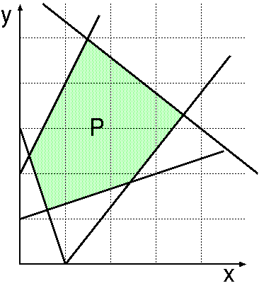
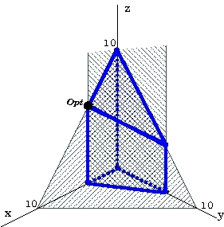
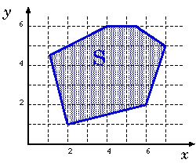

# Folha Prática 4

## 1.

Considere a minimização de $y − 2x$, com $(x, y) \in P$, sendo $P \subseteq (\mathbb{R}_0^+)^2$ o polígono na figura.

1. **Assinale na figura** um ponto que corresponda a uma solução básica ótima e indique se existem soluções ótimas alternativas.
   Explique usando **as curvas de nível** da função objetivo.\
   *Localize apenas o ponto (não o tente calcular).*

2. Desenhe uma árvore de pesquisa que possa ser gerada quando aplica “Branch-and-Bound” (baseado em relaxação linear) para obter uma solução ótima com $(x, y) \in \mathbb{Z}^+_0$.
   Justifique por **interpretação geométrica**, usando a figura.
   Indique a estratégia aplicada em cada nó.

**Sugestão**: *recorde que **as curvas de nível** da função de custo $z = ax + by$ são retas dadas por $y = \frac{z}{b} - \frac{a}{b}x$ as quais, para $z$ fixo, têm ordenada na origem $\frac{z}{b}$ e declive $-\frac{a}{b}$. Logo, se $b > 0$ então $z$ cresce se a ordenada na origem cresce. Se $b < 0$ então $z$ decresce se a ordenada na origem cresce.*

## 2.

Por análise geométrica, averigue a existência de solução ótima para os problemas indicados.

1. minimizar $y$ sujeito a $x + y \geq 10 \wedge x, y \in \mathbb{R}_0^+$

2. maximizar $2x − y$ sujeito a $x + y \geq 10 \wedge x, y \in \mathbb{R}_0^+$

## 3.

Seja $S = \left\{ (x, y, z) \in (\mathbb{R}_0^+)^3 | x + y + z \leq 10 \wedge 2x + y \leq 7 \right\}$ o poliedro representado na figura, o qual corresponde à interseção de $(\mathbb{R}_0^+)^3$ com os semi-espaços definidos pelas restrições indicadas. Queremos determinar $(x, y, z) \in S$ tal que $4x − 3y + 2z$ é **máximo**.

1. Estabeleça a correspondência entre os **vértices** do poliedro e as **soluções básicas admissíveis** do problema na forma normal, dada por **maximizar** $4x − 3y + 2z$ **sujeito a** $x + y + z + s_1 = 10$, $2x + y + s_2 = 7$ **e** $(x, y, z, s_1,s_2 ) \in (\mathbb{R}^+_0)^5$.

2. **Por análise geométrica**, justifique que para resolver o problema pelo Método Simplex se pode partir da solução $(0, 0, 0, 10, 7)$ e que, quando se parte dessa solução, sao necessárias pelo menos duas iterações para chegar à solução ótima (assinalada na figura por $Opt$).

3. Resolva **analiticamente** o problema pelo Método Simplex, partindo de $(0, 0, 0, 10, 7)$.

4. Aplicando *branch-and-bound*, determine $(x, y, z) \in S \cap \mathbb{Z}^3$ tal que $4x − 3y + 2z$ é máximo, isto é, uma solução ótima inteira.

## 4.

Resolva os problemas por aplicação do Método Simplex, **partindo da solução básica admissível** $x = y = z = 0$, $t = 4/5$ e $w = 2/5$ (i.e., com $t$ e $w$ na base). Analise a existência de ótimos alternativos.

**a)**
$$
\begin{align*}
& \bold{minimizar}\text{\space} R = 2x - y + z - 2t - w \\
& \text{sujeito a} \\
& \begin{cases}
3x + 4y + z + 2t + w = 2 \\
2x + y - 3z + 3t - w = 2 \\
x, y, z, t, w \in \mathbb{R}_0^+
\end{cases}
\end{align*}
$$

**b)**
$$
\begin{align*}
& \bold{minimizar}\text{\space} R = 2x - y + z - 2t - w \\
& \text{sujeito a} \\
& \begin{cases}
3x + 4y + z + 2t + w = 2 \\
2x + y - 3z + 3t - w = 2 \\
x, y, z, t, w \in \mathbb{R}_0^+
\end{cases}
\end{align*}
$$

## 5.

A Rede Nacional de Postos de Vigia constitui um dos principais mecanismos de deteção e localização inicial de incêndios florestais, sendo assegurada por vigilantes. E dada prioridade a vigilância de regiões que apresentam maior risco de incêndio. Suponha que $\mathcal{R}$ designa o conjunto dessas regiões, $\mathcal{P}$ o de postos de vigia, e $\mathcal{G_p}$ o das regiões visíveis de $p$, para cada $p \in \mathcal{P}$. Seja $c_r$ o custo de não vigiar a região $r$ e $v_p$ o custo de ativar o posto $p$, com $r \in \mathcal{R}$ e $p \in \mathcal{P}$. Formule matematicamente o problema em cada um dos cenários.

1. Minimizar o número total de postos de vigia ativos mas garantir que todas as regiões ficam sob vigilância.

2. Poder não garantir a cobertura de todas as regiões mas minimizar o custo total.

## 6.

Numa empresa de suinicultura,e necessário fornecer a cada animal adulto, diariamente, além da alimentação padrão, um suplemento de Granulado e Farinha. Cada quilograma de Granulado contém 30g de hidratos de carbono, 75g de vitaminas e 45g de proteínas. Cada quilograma de Farinha contém 75g de hidratos de carbono, 15g de vitaminas e 45g de proteínas. O suplemento diário dado a cada animal adulto, para ser adequado, deve conter pelo menos 300g de hidratos de carbono, pelo menos 225g de vitaminas e pelo menos 315g de proteínas, mas não deve conter mais de 10Kg de Granulado nem mais de 15Kg de Farinha. Cada quilograma de Granulado custa 5€ e cada quilograma de Farinha custa 2.5€. Determinar a quantidade e constituição do suplemento a fornecer diariamente a cada animal, assegurando a qualidade necessária e custo mínimo.

1. Formule matematicamente o problema usando como variáveis de decisão $x_G$ e $x_F$ que indicam a quantidade de Granulado e de Farinha da mistura (em Kg). Indique a interpretação de cada restrição e verifique que a formulação está correta do ponto de vista de dimensões.

2. Resolva o problema por análise geométrica no plano.

3. Reduza o problema à forma normal introduzindo variáveis de desvio.

4. Qual é a solução básica do sistema de equações que corresponde à solução ótima encontrada em **2.**? Aplique o método de Gauss-Jordan para colocar o sistema na forma resolvida, de modo a mostrar que essa solução é ótima. Para tal, inclua também a equação $z − 5x_G − 2.5x_F = 0$, que define o custo.

## 7.

Uma empresa pode produzir cintos de dois tipos $A$ e $B$, com lucros de 0.4 u.m. para os do tipo $A$ e 0.3 u.m. para os do tipo $B$, sendo os primeiros de qualidade superior. Se produzisse apenas cintos do tipo $B$, poderia produzir até 1000 por dia, mas a produção de um cinto $A$ demora o dobro do tempo da produção de um do tipo $B$. Por outro lado, a quantidade de pele que consegue obter diariamente não permite produzir mais do que 800 cintos por dia no total dos dois tipos. Os cintos do tipo $A$ requerem uma fivela especial, nao estando disponíveis mais de 400 por dia. Contudo, para os cintos $B$, a empresa consegue obter 700 fivelas diariamente. Como deve ser a produção diária da fábrica para maximizar o lucro?

Formule matematicamente o problema, indicando a interpretação das variáveis de decisão e das restrições. Resolva o problema por análise geométrica no plano.

## 8.

Seja $S = \left\{(x_1, \dots, x_n) | \sum_{j=1}^n a_{ij}x_j = b_i, i = 1, \dots, m \right\} \cap (\mathbb{R}_0^+)^n$, em que os coeficientes $a_{ij}$’s e $b_i$’s são constantes reais. Mostre que os problemas "minimizar $\sum_{j=1}^n c_j x_j$ para $(x_1, \dots, x_n) \in S$" e "maximizar $\sum_{ij}^n -c_j x_j$ para $(x_1, \dots, x_n) \in S$" têm as mesmas soluções ótimas.

## 9.

Seja $S$ o polígono representado na figura. Os lados do polígono $S$ (ordenados no sentido anti-horário) estão sobre as retas $y = 6$, $2y − x = 8$, $y + 4x = 9$, $4y − x = 2$, $y − 3x = −16$ e $3y + 2x = 29$.

**Por análise geométrica**, para $\mathcal{O}$ indicado em cada alínea, determine escalares $a$ e $b$ tais que $\mathcal{O}$ seja o conjunto das soluções ótimas do problema da **minimização de** $ax + by$ **com** $(x,y) \in S$ seja o indicado ou justifique a não existência de escalares nessas condições.

1. $\mathcal{O} = \{(6, 2)\}$.
2. $\mathcal{O} = \{(x, y) | 4y = −2 + 3x, x \geq 2 , x \leq 62/9 \}$.
3. $\mathcal{O} = \{(x, y) | 2y = 8 +x, x \leq 4 , x \geq 10/9 \}$.

## 10.

Uma firma compra tres tipos de carvão A, B e C, que mistura para formar um produto para aquecimento das casas.
Nao há perda de qualidades no processo de mistura.
O produto final não deve conter mais do que 0.03% de fósforo e 3.25% de impurezas diversas.
As quantidades de fósforo e de impurezas diversas e os preços dos três tipos de carvão estão indicados no quadro seguinte.

| Tipo de Carvão | % fósforo | % impurezas | custo/Kg (u.m.) |
| :------------: | :-------: | :---------: | :-------------: |
|       A        |   0.06    |     2.0     |      0.010      |
|       B        |   0.04    |     4.0     |      0.010      |
|       C        |   0.02    |     3.0     |      0.015      |

Suponha que se um carvão entrar numa dada mistura, a sua percentagem nessa mistura não pode ser inferior a 10%.
Pretende-se saber quais as percentagens de cada um dos carvões na mistura ótima.

Explique porque é que o seguinte modelo traduz o problema enunciado, dando uma interpretação a cada variável de decisão e a cada restrição.
Qual a função de cada variável $\mu_i$, para $i = 1, 2, 3$?

$$
\begin{align*}
& \text{minimizar:\space} 10x_A + 10x_B + 15x_C \\
& \text{sujeito a} \\
& \begin{cases}
0.06x_A + 0.04x_B + 0.02x_C \leq 0.03 \\
2.0x_A + 4.0x_B + 3.0x_C \leq 3.25 \\
x_A + x_B + x_C = 1 \\
x_A, x_B, x_C \geq 0 \\
x_A \geq 0.1\mu_1, \space x_A \leq \mu_1 \\
x_B \geq 0.1\mu_2, \space x_B \leq \mu_2 \\
x_C \geq 0.1\mu_3, \space x_C \leq \mu_3 \\
\mu_i \in \left\{0, 1\right\}, \text{\space para \space} i = 1, 2, 3
\end{cases}
\end{align*}
$$

## 11.

Uma loja de animais de estimação recebeu uma encomenda de peixes tropicais de um certo número de espécies.
Algumas das espécies comem outras.
O dono da loja dispõe de toda a informação sobre este aspeto.
Qual o número mínimo de aquários necessários se a sua capacidade não introduzir restrições adicionais?
Formule matematicamente o problema.
Assuma que $E$ é o conjunto de espécies e $\mathcal{R} \subset E \times E$ define os pares de espécies incompatíveis.
Pode usar como variáveis de decisão:
$z$, o número de aquários usados;
$x_i \in \mathbb{Z}^+$, o identificador do aquário onde fica a espécie $i$, para $i \in E$.
Os aquários são numerados.

## 12.

Uma empresa fabrica três tipos de cadeiras de jardim nomeadamente $Lux$, $Dup$ e $Std$ em pinho.
Semanalmente não vende mais do que 25 cadeiras do tipo $Lux$, mas para as restantes há procura suficiente.
A madeira é recebida em tábuas, sensivelmente do mesmo tamanho, sendo o preço de cada tábua de 3 u.m. (unidades monetárias).
Para fazer uma cadeira do tipo $Lux$ são necessárias quatro tábuas completas.
Cada cadeira dos restantes tipos é feita a partir duma tábua completa.
A fábrica pode armazenar até 400 tábuas, sendo feita apenas uma encomenda semanal a qual é recebida no início da semana seguinte.
Todas as sobras (resultantes dos cortes) são consideradas desperdícios.
A produção de cada cadeira requer, numa primeira fase, trabalho de carpintaria e posteriormente acabamentos, sendo esses trabalhos efetuados em duas secções distintas.
A secção de carpintaria consegue produzir 5 cadeiras do tipo $Std$ numa hora, mas o acabamento de cada cadeira desse tipo demora cerca de 20 minutos.
Cada cadeira do tipo $Lux$ requer em média 30 minutos de trabalho de carpintaria enquanto que as do tipo $Dup$ necessitam ainda de mais 15 minutos.
Na fase de acabamentos, uma cadeira do tipo $Lux$ requer cerca de 10 minutos enquanto as do tipo $Dup$ requerem em média meia hora.
Cada uma das secções não pode trabalhar mais do que 70 horas por semana, sendo o custo da secção de carpintaria de 14 u.m. por hora enquanto que o da secção de acabamentos é 50 u.m.
Por questões de qualidade, as cadeiras devem ficar prontas durante a semana em que se iniciou a sua execução.
O preço de venda de cada cadeira $Lux$ é de 270 u.m., mas as dos tipos $Std$ e $Dup$ são vendidas a 120 e 240 u.m., respetivamente.
Determinar o plano de produção semanal.

Formule matematicamente o problema.
